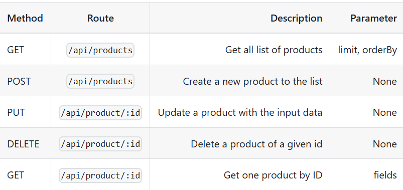

### Requirement
1. Create your database sample
Just like the books.json file as your database, you will need to generate a file called products.json contains a list a products up to 1000 records with format like this:
```json
[
  {
    "id": 1,
    "name": "Product name here",
    "price": 10,
    "description": "Description here",
    "product": "Product type here",
    "color": "Color here",
    "createdAt": "Date here",
    "image": "Image URL"
  }
]
```
You should use the faker.js module to generate the above data and NodeJS fs module write to file. Notice the namespace like ecommerce and random may serve your purpose.
Create a REST API with the given data
With data given above, design a REST API with all resource routes described as below:


#### Get all list of products
* The API should return all the list of products in file products.json.
* The API should have the parameter limit with the request URL like /api/product?limit=5 then return only 5 first products
* The API should have the parameter limit with the request URL like /api/product?sort=desc or /api/product?sort=asc then return products order by createdAt field desc or asc
#### Create a new product to the list
* Write a middleware to validate JSON format of the input
* You should send an JSON request to this API and add a new record. The createdAt will be the value of the submit.
* Use yup to validate input format
#### Update a product with the input data
* Write a middleware to validate JSON format of the input
* The API should receive the JSON request to the API, merge the updated data to the object with the given ID.
* Use yup to validate input format
#### Delete a product of a given id
* Remove the product of id
#### Get one product by ID
The API should have the parameter fields with the request URL like /api/product?fields=name,price then return only picked fields of the product.